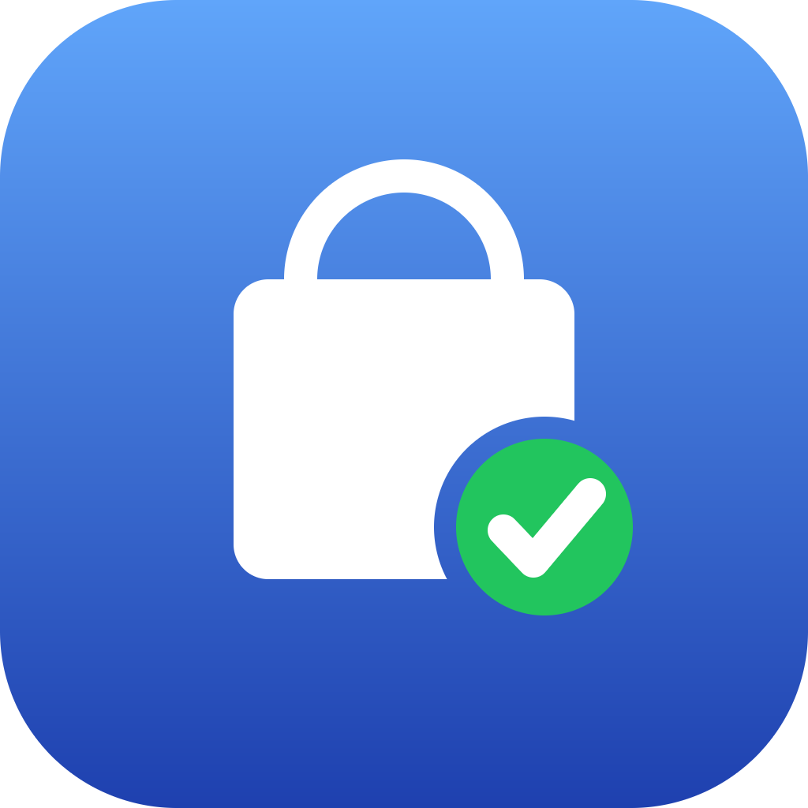
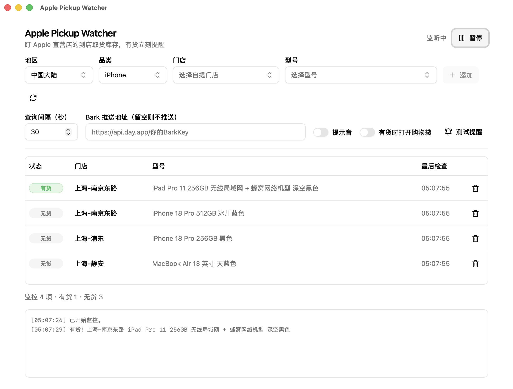

<!-- markdownlint-disable MD033 MD041 -->
<div align="center">



# Apple Pickup Watcher

**Apple Store pickup stock monitor with restock alerts**

Watch the iPhone, iPad, Mac or Apple Watch you want, and get notified the moment it becomes available for pickup at the Apple Store you picked.<br>
Available as a desktop app, the `apw` command line tool, and an agent skill. Free and open source.

<sub>免费开源的苹果直营店到店取货库存监控与到货提醒，支持 macOS、Windows 和 Linux。</sub>

<br>

[](https://github.com/ENCHIGO/apple-pickup-watcher/releases/latest)
[](https://github.com/ENCHIGO/apple-pickup-watcher/releases)
[](https://github.com/ENCHIGO/apple-pickup-watcher/actions/workflows/ci.yml)
[](https://github.com/ENCHIGO/apple-pickup-watcher/actions/workflows/cli.yml)
[](LICENSE)
[](https://github.com/ENCHIGO/apple-pickup-watcher/releases/latest)

[Website](https://enchigo.github.io/apple-pickup-watcher/en/) · [简体中文](README.md) · [Download](https://github.com/ENCHIGO/apple-pickup-watcher/releases/latest) · [CLI docs](docs/cli.md) · [Agent skill](skills/apple-pickup-watcher/SKILL.md) · [FAQ](#faq)

</div>

<br>

<p align="center">
  
</p>

## What it does

| Feature | What it means |
| --- | --- |
| **Three stock states, and failures are never disguised as “out of stock”** | Every target is exactly one of *in stock / out of stock / unknown*. When a query is blocked, rate-limited, fails on the network, or the response shape changes, you see **“unknown” with the reason** and a “monitoring is currently unreliable” warning, never a silent “out of stock”. |
| **Watch many stores and models at once** | Mix targets from different product categories and different stores in one list. iPhone is picked in three steps (model → capacity → colour); other categories pick the full model directly, and every dropdown is searchable. |
| **Closing the window doesn’t quit** | The app moves to the system tray and the Rust backend keeps querying and alerting, so it can sit there for hours before a launch without an open window. |
| **Alerts on every channel you need** | Desktop notifications, an alert sound, and optional [Bark](https://github.com/Finb/Bark) push to your iPhone. Continuous availability is not re-announced every cycle; the app can open your shopping bag automatically if enabled. |
| **Model catalog refreshes from Apple** | An offline snapshot is built in, and one click refreshes the current category from Apple’s buy pages, so new models on already supported pages can be watched on launch day. |
| **CLI and agent skill** | The `apw` command prints JSON / NDJSON and needs no desktop environment; the bundled skill lets agents such as Codex check stock and wait for restocks directly. |

Installers are around 3 MB (except the Linux AppImage). Built with Rust + Tauri 2, with a React interface.

## Quick start

### Desktop app

Grab the installer for your platform from [Releases](https://github.com/ENCHIGO/apple-pickup-watcher/releases/latest):

| Platform | Package | Notes |
| --- | --- | --- |
| macOS | `.dmg` (separate builds for Apple Silicon and Intel, pick the right one) | Not notarized by Apple; if it is blocked on first launch, run the command below |
| Windows | `x64-setup.exe` / `.msi` | Not code-signed; when SmartScreen appears, choose “More info” → “Run anyway” |
| Linux | `.AppImage` / `.deb` / `.rpm` | The AppImage needs `chmod +x` first |

```bash
# macOS: clear the download quarantine flag for this one app only
xattr -cr "/Applications/Apple Pickup Watcher.app"
```

Installation details, Bark push, and the config file location are in the [desktop guide](docs/desktop.md).

### CLI `apw`

```bash
git clone https://github.com/ENCHIGO/apple-pickup-watcher.git
cd apple-pickup-watcher
cargo install --path crates/apw-cli --locked   # installs into ~/.cargo/bin
```

All you need is stable Rust; no Node, desktop environment, or audio device. Prebuilt packages can be downloaded from any successful run of the [CLI workflow](https://github.com/ENCHIGO/apple-pickup-watcher/actions/workflows/cli.yml) (Artifacts, GitHub login required); each package includes the skill and the docs.

### Agent skill

With Node.js LTS installed, one [Skills CLI](https://github.com/vercel-labs/skills) command installs it into Codex:

```bash
npx skills add ENCHIGO/apple-pickup-watcher --skill apple-pickup-watcher --agent codex --global
```

For Claude Code replace `codex` with `claude-code`; drop `--global` to install into the current project. This installs only the skill, so `apw` still needs to be installed and on your PATH as described above; manual installation is covered in the [CLI docs](docs/cli.md#安装-skill). Then just ask in a new session:

> Use $apple-pickup-watcher to check iPhone 512GB pickup stock at Apple Stores in Shanghai, and list the available models first so I can pick one.

## How to use it

### Desktop in three steps

1. **Add targets**: choose region → category → store → model and click “Add”. For iPhone, pick the model, capacity and colour step by step. Add as many as you like, mixing categories and stores freely.
2. **Start watching**: click “Start”. Keep the app running and your computer online and awake; closing the window moves it to the tray and keeps it going. It polls every 30 seconds by default, with a minimum of 5 seconds.
3. **Get the alert, then buy on Apple’s website**: when stock is confirmed you get a desktop notification, the alert sound, and a Bark push, and the shopping bag can open if enabled. Adding the item, choosing the pickup store, checkout, and payment are done by you on Apple’s website.

Continuous availability is not re-announced every cycle; a target alerts again only after it leaves the in-stock state and comes back. When you see “monitoring is currently unreliable”, don’t trust the “out of stock” rows in the list. Follow the hint and find the cause first.

### CLI / agent

```bash
apw regions                                                    # supported regions
apw stores   --locale zh_CN --search 上海                       # store numbers
apw products --locale zh_CN --category iphone --search 512GB   # SKUs
apw check    --locale zh_CN --store R359 --part 'MJTF4CH/A' --timeout 60    # one query, JSON output
apw watch    --targets targets.json --until-in-stock --timeout 300          # keep watching, one NDJSON line per event
```

`check` returns a shape like this (the example status is not live stock):

```json
{
  "schemaVersion": 1, "command": "check", "healthy": true, "anyInStock": false,
  "snapshot": [{
    "target": { "locale": "zh_CN", "storeNumber": "R359", "storeTitle": "上海-南京东路",
                "partNumber": "MJTF4CH/A", "productName": "iPhone 18 Pro 512GB 冰川蓝色" },
    "availability": { "kind": "out_of_stock" },
    "lastCheckedMs": 1789000000000, "consecutiveFailures": 0
  }]
}
```

`availability.kind` is one of `in_stock` / `out_of_stock` / `unknown`, and `unknown` always carries a `reason` (such as `blocked`). Exit code 0 only means the query succeeded; it **does not mean in stock**. A failed query, a missing result, or a timeout must never be read as “out of stock”. The batch target format, `watch` event types, exit codes, and `apw schema` are covered in the [CLI docs](docs/cli.md).

## What’s covered

- **Products**: iPhone (18 Pro / 18 Pro Max, Duo, 17, Air) · iPad (Pro, Air, iPad, mini) · Mac (MacBook Air / Pro / Neo, iMac, Mac mini, Mac Studio, Studio Display) · Apple Watch (Series, SE, Ultra, Hermès)
- **Regions**: China mainland · Hong Kong · Taiwan · Japan · Singapore · Australia · Malaysia
- **Platforms**: macOS (Apple Silicon / Intel) · Windows x64 · Linux x86_64

The exact models and stores depend on the built-in catalog and the regional Apple online store; models on newly added buy pages require an app update. Region support does not guarantee that every query succeeds. Apple Watch is monitored by case: each query automatically includes one band part number from the same buy page, because Apple’s pickup endpoint only treats “case + band” as a sellable kit ([details](docs/desktop.md#apple-watch-按表壳监控)).

## FAQ

### Why does apple-store-helper always say “out of stock” when Apple’s website shows stock?

The `/shop/fulfillment-messages` endpoint it depends on no longer works and answers requests with an HTTP 541 interception page. Because that project treated failed requests as “out of stock”, the interface looked perfectly healthy while showing no stock forever. This project queries `/shop/retail/pickup-message` instead and keeps failed queries as “unknown” with a reason, so the next time the endpoint changes you see a warning rather than a screen full of false “out of stock”.

### What is the difference between “unknown”, “pending”, and “out of stock”?

“Pending” means the first query hasn’t completed yet. “Unknown” means this query did not produce a definite result, possibly because of blocking, rate limiting, a network failure, or a changed response shape. “Out of stock” means the query returned an explicit not-available-for-pickup result. Only the last one actually means there is no stock.

### The app reports HTTP 541 or “request blocked”, but Apple’s website opens fine in my browser?

Treat it as a failed query and don’t draw any conclusion about stock from it. The cause is a per-IP limit on Apple’s pickup endpoint: roughly 30 back-to-back requests trigger 541, and everything keeps failing for ten to fifteen minutes afterwards. Since v0.4.2 the app merges same-city stores into one request, paces requests against a budget (stretching the interval automatically and saying so in the UI when the budget runs low), and cools down before probing again after a block. If you keep getting blocked after upgrading, please open an [issue](https://github.com/ENCHIGO/apple-pickup-watcher/issues) with the version, region, store / SKU, and a redacted log. Other tools or browsers on the same egress IP share that budget.

### Will I still get alerts after closing the window?

Yes. Closing the window only moves the app to the system tray, where it keeps querying and alerting; only “Quit” in the tray menu stops it. Your computer needs to stay online and awake.

### Does it order automatically? Does it guarantee I get one?

No, and no. It only checks stock and alerts you, and at most opens your shopping bag if enabled. Adding the item, choosing the store, checkout, and payment are done by you on Apple’s website. Stock can change after an alert, and the app does not reserve anything.

### How do I get alerts on my phone?

Install [Bark](https://github.com/Finb/Bark) on your iPhone, paste the push URL it gives you into the “Bark push URL” field in settings, and click “Test alert” to confirm the whole chain works. A failed push never changes the stock verdict.

### Why is the default polling interval 30 seconds?

Store stock does not flip back and forth within seconds, and 30 seconds is plenty for launch-day buying. The minimum is 5 seconds; anything lower falls back to 30. It is a floor, not a promise: Apple limits pickup queries per egress IP, so the app stretches the real interval to fit its request budget (one request per city per cycle, roughly one per minute at steady state) and shows the next check time in the footer. Please don’t use it for bulk buying for resale, which only gets this route shut down for everyone.

More: [desktop guide](docs/desktop.md) · [CLI docs](docs/cli.md) · [development and maintenance](docs/development.md)

## Documentation

| Document | Contents |
| --- | --- |
| [Desktop guide](docs/desktop.md) | Installation, monitoring and alert rules, model catalog, Bark, config file, FAQ |
| [CLI and agent skill](docs/cli.md) | Build and install, commands, JSON / NDJSON format, batch targets, exit codes |
| [Development and maintenance](docs/development.md) | Toolchain, checks, code layout, live API contract tests, release process |
| [Website maintenance](docs/discoverability.md) | Building and deploying the project site, search indexing conventions |
| [Agent skill](skills/apple-pickup-watcher/SKILL.md) | Usage instructions written for agents |

The detailed guides are currently written in Chinese.

## Origin and license

This project is a Rust + Tauri rewrite of [hteen/apple-store-helper](https://github.com/hteen/apple-store-helper) (GPL-3.0), released under **GPL-3.0-or-later**. The original license is in [LICENSE](LICENSE); the derivation, the original authors’ copyright notice, and a summary of changes are in [NOTICE](NOTICE). If the original project still works for you, please support its author first.

This project is not affiliated with, authorized by, or endorsed by Apple Inc. It is for personal stock checks only: it does not reserve stock or guarantee a purchase, and the final availability and pickup information is whatever Apple’s website says. You use this tool at your own risk.

If it helped you get the device you were waiting for, a ⭐ helps others find it.
